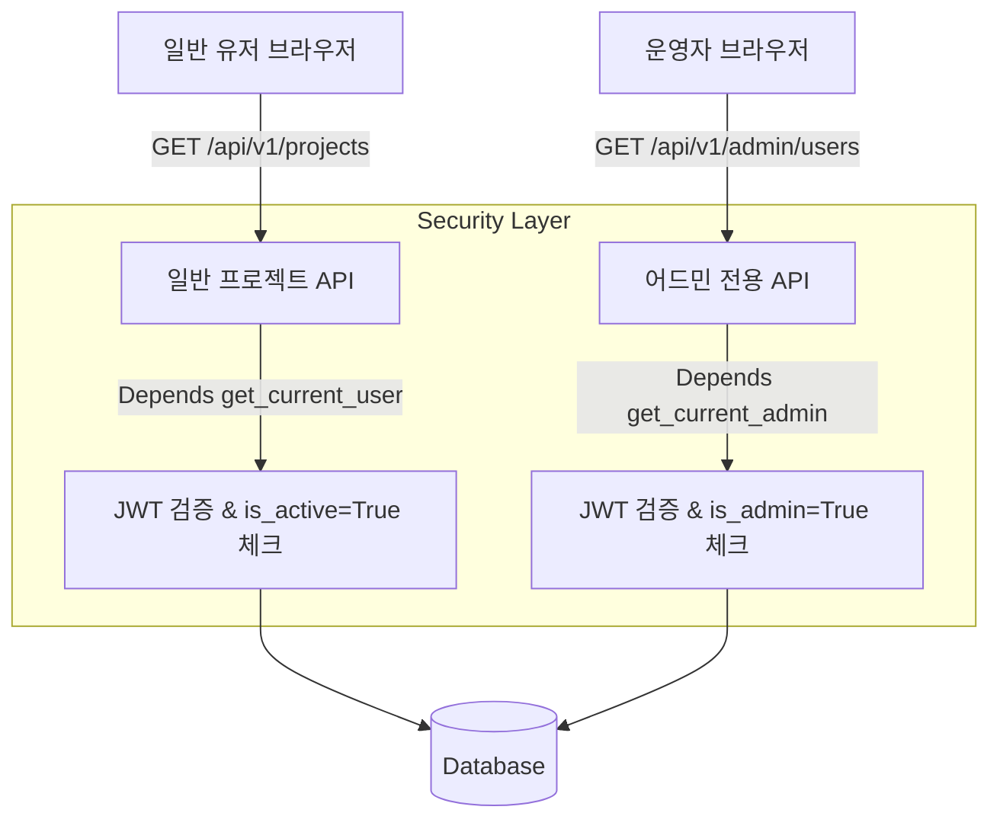

# 웹 기반 운영자 관리 도구 (Admin Web) 기획 및 설계서

본 문서는 소설싸게 시스템의 효율적인 가입 승인, 회원 상태 조율, 토큰 사용량 관리를 위해 추가되는 **웹 기반 운영자 관리 도구(Admin Web)**의 화면 설계 및 API 백엔드 사양을 정의합니다.

---

## 🏗️ 1. 개념 아키텍처 및 보안 서브시스템

기존 유저의 접근을 제한하고 엄격한 역할 기반 제어(RBAC)를 적용하기 위하여 `get_current_admin` 의존성 계층을 백엔드에 구축합니다.



### 1.2. 프론트엔드 통합 라우팅 구조 (Single Project SPA)
본 관리자 기능은 별도의 독립된 프론트엔드 웹 서버를 구동하지 않고, **기존 소설싸게 프론트엔드 리포지토리(React/Vue SPA) 내부에 운영자 뷰 컴포넌트를 통합 빌드**하는 구조를 취합니다.

* **라우팅 구조**:
  - 프론트엔드 클라이언트 라우터(Router)에 `/admin` 경로를 추가하고, 관리자 전용 레이아웃을 바인딩합니다.
* **FastAPI SPA Fallback 연동**:
  - FastAPI의 메인 엔트리 [main.py](file:///C:/Users/parkp/Workspace/personal/my-agent/app/main.py)에 탑재된 SPA Fallback API 필터는 `/admin` 경로 접속 시 404 에러를 내지 않고 그대로 `dist/index.html` 파일을 서빙합니다. 이후 프론트엔드 브라우저 라우터가 경로를 인계받아 해당 UI를 렌더링합니다.
* **클라이언트-백엔드 2단계 보안 가드**:
  1. *클라이언트 가드 (1차)*: 사용자의 JWT 토큰 페이로드 내 `is_admin` 필드가 `true`가 아닐 경우, 메인 페이지(`/`)로 리다이렉트합니다.
  2. *백엔드 API 가드 (2차)*: 어드민 라우터 내 모든 엔드포인트는 `get_current_admin` 의존성에 의해 토큰의 실제 유효성 및 DB 상의 어드민 필드를 검사하여 무단 조회를 완전 차단합니다.

---

## 🎨 2. UI 화면 기획 및 레이아웃

어드민 UI는 반응형 L-Layout(사이드바 + 메인 콘텐츠) 구조로 구성하여 편의성을 확보합니다.

### 2.1. 전체 레이아웃 (L-Layout)
```
┌────────────────────────────────────────────────────────────────────────┐
│  소설싸게 ADMIN PORTAL                                   [운영자님 로그아웃] │
├─────────────┬──────────────────────────────────────────────────────────┤
│             │ ■ 대시보드 현황                                           │
│  [대시보드] │ ┌──────────────┐ ┌──────────────┐ ┌──────────────┐       │
│             │ │ 가입대기: 4명│ │ 프로젝트: 12 │ │ 에피소드: 86 │       │
│  [회원관리] │ └──────────────┘ └──────────────┘ └──────────────┘       │
│             │                                                          │
│  [로그분석] │ ■ 최근 가입 승인 대기자 목록                              │
│             │ ┌────┬─────────┬───────────┬───────────────────┬───────┐ │
│  [설정관리] │ │ ID │ 유저이름│ 가입신청일│ 이메일            │ 액션  │ │
│             │ ├────┼─────────┼───────────┼───────────────────┼───────┤ │
│             │ │ 12 │ user_01 │ 2026-07-15│ user@example.com  │[승인] │ │
│             │ └────┴─────────┴───────────┴───────────────────┴───────┘ │
└─────────────┴──────────────────────────────────────────────────────────┘
```

### 2.2. 세부 탭 상세 설계
1. **대시보드 탭**:
   - 시스템 현황 수치 카드화 (가입대기, 총 가입자, 활성 프로젝트, 에피소드 발행 수)
   - 실시간 에러 로깅 통계
2. **회원 관리 탭**:
   - **가입 대기자(is_active=False, rejected_at=None)** 리스트 필터링 및 원클릭 '승인' / '거절' 버튼 배치
   - **전체 회원 목록**: 검색 기능 탑재 (ID, 유저이름, 이메일). 
   - 회원 행위 제어: '계정 일시 정지(is_active=False로 변경)', '어드민 권한 부여(is_admin=True로 변경)' 및 '회원 탈퇴(Delete)' 기능 제공

---

## 🛠️ 3. 백엔드 API 명세서 (Admin API Specification)

모든 어드민 API는 `/api/v1/admin` 프리픽스를 공유하며, 내부 인가 의존성 `Depends(get_current_admin)`에 의해 관리자 세션이 아님이 검증될 경우 `403 Forbidden` 에러를 반환합니다.

### 3.1. 관리자 권한 검증 의존성 (Security Dependency)
* **함수명**: `async def get_current_admin(current_user: User = Depends(get_current_user))`
* **검증 로직**:
  ```python
  if not current_user.is_admin:
      raise HTTPException(
          status_code=status.HTTP_403_FORBIDDEN,
          detail="Access denied: Admin role required."
      )
  return current_user
  ```

### 3.2. 핵심 API 엔드포인트 목록

#### 1) 시스템 현황 통계 조회
* **Endpoint**: `GET /api/v1/admin/stats`
* **Response**: `200 OK`
  ```json
  {
    "total_users": 150,
    "pending_users": 4,
    "total_projects": 34,
    "total_episodes": 218
  }
  ```

#### 2) 전체 회원 목록 조회 (페이징 & 필터 적용)
* **Endpoint**: `GET /api/v1/admin/users`
* **Query Parameters**:
  - `page`: `int` (기본값: 1)
  - `size`: `int` (기본값: 20)
  - `status`: `pending` | `active` | `rejected` (선택적 필터)
  - `search`: `str` (유저이름 또는 이메일 검색 키워드)
* **Response**: `200 OK`
  ```json
  {
    "items": [
      {
        "id": 12,
        "username": "novel_writer",
        "email": "writer@domain.com",
        "is_active": false,
        "is_admin": false,
        "created_at": "2026-07-15T10:30:00Z",
        "rejected_at": null
      }
    ],
    "total": 1,
    "page": 1,
    "size": 20
  }
  ```

#### 3) 회원 승인/거절/일시정지 상태 일괄 조율
* **Endpoint**: `PATCH /api/v1/admin/users/{user_id}/status`
* **Request Body**:
  ```json
  {
    "action": "approve" // "approve" | "reject" | "suspend"
  }
  ```
* **Response**: `200 OK`
  ```json
  {
    "status": "success",
    "user_id": 12,
    "is_active": true,
    "rejected_at": null
  }
  ```

#### 4) 관리자 권한 부여 및 회수
* **Endpoint**: `PATCH /api/v1/admin/users/{user_id}/role`
* **Request Body**:
  ```json
  {
    "is_admin": true
  }
  ```
* **Response**: `200 OK`

---

## 🔒 4. 보안 및 예외 처리 정책

1. **최초 어드민 생성 (Bootstrap Seeding)**
   - 시스템 가동 최초 시점에 어드민을 생성할 수 있도록 환경변수(`INITIAL_ADMIN_USERNAME`, `INITIAL_ADMIN_PASSWORD`, `INITIAL_ADMIN_EMAIL`) 설정을 지원합니다.
   - **시딩 작동 트리거**: FastAPI `lifespan` 시작 주기에서 `init_db()` 완료 직후 `seed_initial_admin()`이 자동 실행되며, DB 상에 `is_admin == True`인 관리자 계정이 **0명**일 경우에만 자동으로 해당 자격증명을 파싱 및 해싱하여 최초 활성 관리자 계정을 적재합니다.
   - **테스트 무작동 가드**: `TESTING == "True"`인 테스트 격리 환경인 경우에는 이 시딩 단계를 건너뜁니다.
2. **자기 권한 회수 방지 가드 (Self-Revoke Guard)**
   - 로그인된 관리자 본인이 본인의 `is_admin` 권한을 `False`로 낮추거나 본인의 계정을 비활성화(`suspend`) 또는 삭제할 수 없도록 강제 예외 필터를 추가합니다.
3. **가입 거절 회원 복구 메커니즘**
   - 텔레그램이나 어드민 웹을 통해 한 번 거절(`rejected_at`에 타임스탬프 기록됨)된 유저라 하더라도, 어드민 관리 창에서 `approve` 처리 시 `rejected_at=None` 및 `is_active=True`로 변환하여 즉시 계정을 부활할 수 있게 설계합니다.
