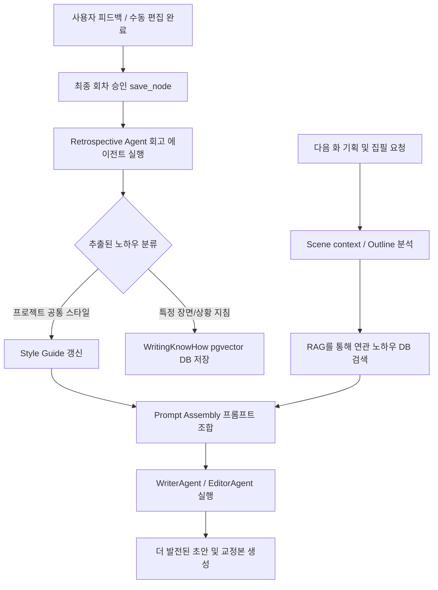

# AI 소설 집필 에이전틱 머신: 집필 노하우 지속 학습 및 진화 엔진 설계안 (Continuous Learning Engine)

## 1. 개요 및 핵심 컨셉

본 문서에서는 AI 소설가 에이전트가 회차별 집필을 반복하며 **사용자의 피드백(HITL), 수동 교정 내역(Human Editing), 평가 에이전트(Judge/Reviewer)의 피드백**을 분석하여, **프로젝트별 고유의 집필 노하우(Writing Know-how)를 스스로 정립하고 다음 집필에 실시간으로 반영하는 지속 진화 체계**를 설계합니다.

### 1.1 현재 구조의 한계
* **일회성 피드백**: 사용자 피드백이나 에디터 수정 사항이 해당 회차(Episode)의 집필 루프 내에서는 작동하지만, 다음 회차(e.g., 2화 $\rightarrow$ 3화)로 넘어갈 때 **프롬프트나 규칙 레벨로 축적되지 못하고 유실**됩니다.
* **하드코딩된 프롬프트**: `WriterAgent`와 `EditorAgent` 등 핵심 에이전트의 스타일 지침이 정적으로 굳어 있어, 특정 작가가 원하는 고유의 문체나 장르적 연출 디테일을 맞춤형으로 반영하기 어렵습니다.

### 1.2 지속 진화 엔진 (Continuous Learning Engine)의 지향점
1. **사후 회고 루프 (Post-Episode Retrospective)**: 한 회차가 최종 승인(`is_approved=True`)되는 시점에, **초기 드래프트 vs 피드백 vs 수동 수정본(최종본)**을 대조하여 "배운 점(Lessons Learned)"을 자동으로 추출합니다.
2. **이원화된 노하우 기억 저장소**:
   * **글로벌 프로젝트 스타일 가이드 (Auto-updating Style Guide)**: 모든 회차에 공통 적용할 범용 문체 규칙(e.g., 특정 어투 배제, 주인공 어조 고정 등)을 지속적으로 단일 텍스트/마크다운 문서로 병합·갱신합니다.
   * **시맨틱 노하우 DB (Vectorized Know-How RAG)**: 특정 상황(e.g., 전투 묘사, 로맨스 대화, 감정적 독백)에 특화된 피드백 사례를 pgvector DB에 임베딩하여 저장하고, 유사한 씬을 집필할 때만 동적으로 소환(RAG)해 주입합니다.

---

## 2. 아키텍처 및 데이터 흐름



---

## 3. 데이터 모델 설계 (`app/models.py` 확장 제안)

지속 학습 데이터를 적재하기 위해 [app/models.py](file:///C:/Users/parkp/Workspace/personal/my-agent/app/models.py)에 다음과 같은 신규 테이블과 기존 테이블 필드 확장을 제안합니다.

### 3.1 신규 테이블: `WritingKnowHow` (시맨틱 노하우 DB)
특정 상황이나 묘사에 국한된 개별 교정 노하우를 시맨틱 검색이 가능하도록 벡터 임베딩과 함께 저장합니다.

```python
class WritingKnowHow(SQLModel, table=True):
    """지속 학습 엔진을 통해 추출된 세부 집필 노하우 및 피드백 극복 사례."""
    __tablename__ = "writing_know_how"

    id: Optional[int] = Field(default=None, primary_key=True)
    project_id: int = Field(foreign_key="project.id", nullable=False, index=True)
    episode_id: Optional[int] = Field(foreign_key="episode.id", nullable=True) # 발생 원천 회차
    
    category: str = Field(default="general", nullable=False) # general | style | dialogue | action | logic | lore
    context_trigger: str = Field(nullable=False) # RAG 쿼리 및 매칭을 위한 상황 키워드 (e.g. "검술 전투 묘사", "히로인의 까칠한 대화")
    problem_identified: str = Field(nullable=False) # 기존에 발생했던 문제점/사용자 불만 사항
    lesson_learned: str = Field(nullable=False) # 해결책 및 AI가 향후 준수해야 할 구체적인 집필 지침
    
    # RAG 검색용 1536차원 OpenAI/Google 임베딩
    embedding: Optional[List[float]] = Field(
        default=None,
        sa_column=Column(Vector(1536), nullable=True)
    )
    
    created_at: datetime = Field(default_factory=datetime.utcnow)
    
    project: "Project" = Relationship(back_populates="writing_know_hows") # Project 에 관계 설정 추가
```

### 3.2 기존 테이블 확장
* **`Project` 테이블**:
  * `style_guide`: 기존의 단순 수동 기록 텍스트 필드를 **"AI가 매 에피소드 종료 후 스스로 통합 및 유지보수하는 마크다운 스타일북"**으로 용도 전환.
* **`Content` 테이블**:
  * 집필 및 피드백 이력을 대조할 수 있도록, 해당 에피소드의 **초기 원본 AI 드래프트**와 **최종 승인본(is_approved=True)**, 그리고 중간 과정에서 사용자가 입력한 **`user_feedback`**을 보존하고 관계를 명확히 추적합니다.

---

## 4. 에이전트 설계 및 프롬프트

### 4.1 회고 에이전트 (Retrospective Agent)
회차 최종 승인 시 실행되어, 계획과 최초 드래프트, 사용자 수정본 및 피드백을 비교 대조하여 지침을 추출합니다.

* **시스템 프롬프트 (`RetrospectiveAgent.SYSTEM_PROMPT`)**:
```text
당신은 베스트셀러 웹소설의 구조와 스타일 분석에 특화된 수석 편집자이자, AI 집필 학습 분석가입니다.
이번에 집필이 최종 승인된 회차의 [집필 히스토리]를 분석하여, 앞으로 이 소설을 더 완성도 있게 쓰기 위해 AI가 깊이 새겨야 할 '실천적 집필 노하우'와 '문체 지침'을 추출해 주세요.

[소설 기본 정보]
- 작품 시놉시스: {synopsis}
- 전체 스타일 가이드: {current_style_guide}

[집필 히스토리]
1. 이번 회차 아웃라인: {outline}
2. 최초 AI 드래프트 본문: {initial_draft}
3. 중간 사용자 피드백 & 에이전트 비판 사항: {feedbacks}
4. 최종 승인 및 교정 완료된 본문: {approved_text}

[작업 가이드라인]
1. 최초 AI 드래프트와 최종 승인본을 철저히 대조하십시오.
   - 사용자가 직접 깎아내거나 추가한 문장의 스타일(대사 톤, 호흡, 수식어 빈도)을 분석하세요.
   - 예를 들어, 사용자가 본문에서 지나치게 장황한 마술 영창 묘사를 대거 들어냈다면, 이는 "마술 사용 시 주문 묘사를 1줄 이내로 절제할 것"이라는 강한 지침이 됩니다.
2. 분석 결과를 다음 두 가지로 분류해 출력하십시오.
   - A. [글로벌 스타일 가이드 반영 사항]: 작품 전체에 항시 유지해야 할 문법/문체 원칙 (예: 주인공의 어미 처리, 비문 방지 규칙)
   - B. [상황별 실천 노하우 (WritingKnowHow)]: 특정 트리거(상황, 인물 대치, 공간 등)가 주어졌을 때 RAG로 호출할 수 있는 국소적 규칙
3. 노하우는 절대 "독자의 흥미를 끌도록 쓰기"와 같이 추상적이어서는 안 되며, "전투 중에는 주인공이 경망스러운 한자어를 쓰지 않고, 3인칭 시점으로 주변 풍경 묘사를 생략한 채 동작에 집중할 것"처럼 즉각 코드/글쓰기에 적용 가능한 수준이어야 합니다.

출력 포맷은 반드시 아래 JSON 스키마를 엄격히 준수하십시오.
```

* **출력 JSON Schema**:
```json
{
  "global_style_updates": [
    "추가되거나 수정되어야 할 공통 스타일 가이드 문장 1",
    "추가되거나 수정되어야 할 공통 스타일 가이드 문장 2"
  ],
  "situational_know_how": [
    {
      "category": "action | dialogue | lore | description | pacing",
      "context_trigger": "노하우가 적용될 핵심 장면/맥락을 대표하는 구체적 키워드 및 시나리오 (예: 주인공과 길드장의 서열 정리 대화)",
      "problem_identified": "최초 생성 시 드러난 AI의 부족함 또는 설정 모순점",
      "lesson_learned": "향후 유사 씬 생성 시 절대적으로 준수해야 할 구체적인 지침 및 금지 조항"
    }
  ]
}
```

---

## 5. 워크플로우 통합 및 노하우 적용 방법

### 5.1 사후 학습 단계 (Post-Writing Learning)
[save_node](file:///C:/Users/parkp/Workspace/personal/my-agent/app/services/workflow.py#L1021)가 성공적으로 작동하여 원고가 저장된 후, 비동기 백그라운드 태스크로 `run_retrospective_and_learn` 함수를 트리거합니다.

```python
async def run_retrospective_and_learn(
    session: AsyncSession, 
    project_id: int, 
    episode_id: int,
    initial_draft: str,
    approved_text: str,
    feedbacks: str,
    outline: str
):
    # 1. Retrospective Agent 호출 -> JSON 출력 파싱
    analysis_result = await RetrospectiveAgent().analyze(
        synopsis=...,
        current_style_guide=...,
        initial_draft=initial_draft,
        approved_text=approved_text,
        feedbacks=feedbacks,
        outline=outline
    )
    
    # 2. 글로벌 스타일 가이드 업데이트
    if analysis_result.global_style_updates:
        await update_project_style_guide(session, project_id, analysis_result.global_style_updates)
        
    # 3. 상황별 실천 노하우 DB 저장 & 임베딩 생성 (RAG용)
    for know_how in analysis_result.situational_know_how:
        # trigger 단어를 바탕으로 RAG용 1536차원 임베딩 생성
        embedding = await get_embedding(know_how["context_trigger"])
        db_know_how = WritingKnowHow(
            project_id=project_id,
            episode_id=episode_id,
            category=know_how["category"],
            context_trigger=know_how["context_trigger"],
            problem_identified=know_how["problem_identified"],
            lesson_learned=know_how["lesson_learned"],
            embedding=embedding
        )
        session.add(db_know_how)
    await session.commit()
```

### 5.2 사전 지침 주입 단계 (Pre-Writing Injection)
다음 화(e.g., N+1화) 집필 시작 시, 에피소드 아웃라인과 씬 요약을 기반으로 축적된 노하우 중 가장 관련성 높은 상위 K개의 규칙을 RAG로 소환합니다.

```python
async def build_writer_know_how_context(
    session: AsyncSession, 
    project_id: int, 
    episode_outline: str
) -> str:
    # 1. 에피소드 아웃라인의 임베딩 생성
    outline_embedding = await get_embedding(episode_outline)
    
    # 2. pgvector 유사도 검색 실행
    stmt = (
        select(WritingKnowHow)
        .where(WritingKnowHow.project_id == project_id)
        .order_by(WritingKnowHow.embedding.cosine_distance(outline_embedding))
        .limit(3)
    )
    results = (await session.execute(stmt)).scalars().all()
    
    # 3. 과거 실패 및 극복 노하우 텍스트 조합
    if not results:
        return "N/A"
        
    context_lines = []
    for idx, r in enumerate(results):
        context_lines.append(
            f"노하우 {idx+1}. [{r.context_trigger} 상황 지침]\n"
            f"  - 과거 문제점: {r.problem_identified}\n"
            f"  - 준수할 지침: {r.lesson_learned}"
        )
    return "\n\n".join(context_lines)
```

이 조합된 텍스트(`writer_know_how_context`)와 `style_guide`가 `WriterAgent` 및 `EditorAgent` 생성 시점에 주입됩니다.
* **Writer Prompt 주입 예시**:
```text
...
[작품 고유의 글로벌 스타일 가이드]
{style_guide}

[이전 집필을 통해 체득한 관련 노하우 (RAG)]
{writer_know_how_context}

위 지침들을 철저하게 인지하고 반영하여, 독자가 읽었을 때 피드백되었던 단점을 완벽히 회피할 수 있는 문장으로 소설을 집필하십시오.
...
```

---

## 6. 구현 로드맵 및 실행 전략

1. **Phase 1: 글로벌 스타일 가이드 자율 갱신 시스템 구축**
   - 별도 테이블 신설 없이, 기존 `Project.style_guide` 컬럼을 활용.
   - 에피소드 완료 시 `save_node` 끝단에 에이전트를 트리거하여 `style_guide` 텍스트를 LLM이 편집 및 자동 반영하도록 구현하여 빠른 효용감 제공.
2. **Phase 2: `WritingKnowHow` 테이블 구축 및 pgvector RAG 통합**
   - 데이터베이스 마이그레이션(Alembic 또는 DB 재생성)을 통해 `WritingKnowHow` 테이블 추가.
   - Tavily/Semantic Search 유틸리티를 활용하여 아웃라인 기반의 실시간 큐레이션 통합.
3. **Phase 3: 사용자 보정 (HITL) UI 연동**
   - AI가 회고 결과물("이번 회차를 통해 배운 집필 노하우")을 대시보드나 원고 내보내기 탭에 카드로 시각화하여 보여주고, 사용자가 직접 해당 규칙을 수정하거나 삭제할 수 있는 관리 피처를 추가하여 AI의 학습 편향 방지.
