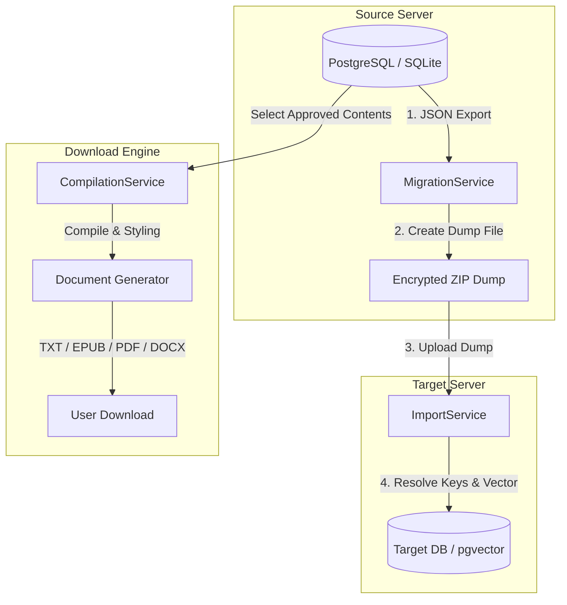
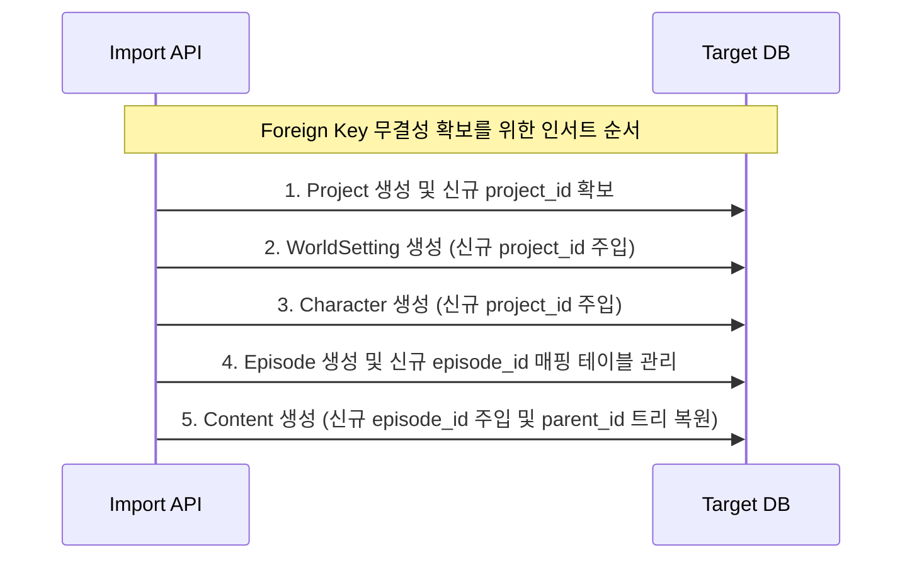
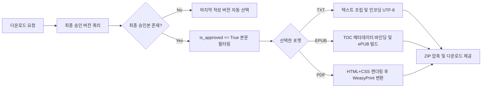

# 소설 프로젝트 DB 마이그레이션 & 문서 다운로드 기능 설계서

본 문서는 소설 집필 프로젝트 시스템 내에서 **(1) 프로젝트 데이터를 구조화하여 다른 서버의 데이터베이스(DB)로 안전하게 마이그레이션(이관)하는 설계**와 **(2) 집필된 소설 본문을 다양한 문서 포맷(TXT, EPUB, PDF 등)으로 다운로드받는 컴파일링 엔진 설계**를 다룹니다.

---

## 🏗️ 1. 시스템 개념 아키텍처

전체 기능은 FastAPI 백엔드의 비동기 컨트롤러 및 백그라운드 태스크 엔진을 통해 이뤄지며, 이기종 DB 호환성과 비동기 대용량 파일 처리를 최우선으로 고려합니다.



---

## 🔒 2. 소설 프로젝트 DB 마이그레이션 설계

이기종 데이터베이스(예: 개발용 SQLite ➔ 운영용 PostgreSQL + pgvector) 간의 이관 및 프로젝트 독립형 덤프를 지원하기 위해 **JSON 기반의 독자적 아카이브 구조**를 채택합니다.

### 2.1. 내보내기(Export) 덤프 파일 스펙 (JSON Schema)
덤프 파일은 프로젝트의 모든 메타데이터, 캐릭터, 설정집(RAG 임베딩 벡터 포함), 회차, 승인된 본문 및 히스토리를 포함합니다.

```json
{
  "version": "1.0",
  "exported_at": "2026-07-14T11:17:44Z",
  "project": {
    "title": "테스트 판타지 소설",
    "synopsis": "번개 천재 소년의 성장기",
    "llm_provider": "openai",
    "llm_model": "gpt-4o-mini",
    "plotter_provider": null,
    "plotter_model": null,
    "writer_provider": null,
    "writer_model": null,
    "judge_provider": null,
    "judge_model": null,
    "editor_provider": null,
    "editor_model": null,
    "reviewer_provider": null,
    "reviewer_model": null
  },
  "world_settings": [
    {
      "keyword": "아르카나 마법학교",
      "category": "location",
      "description": "역사 깊은 명문 마법학교",
      "embedding": [0.012, -0.004, 0.952, "...", 0.003] 
    }
  ],
  "characters": [
    {
      "name": "루엘",
      "description": "번개 능력을 타고난 병약한 주인공",
      "importance": "protagonist"
    }
  ],
  "episodes": [
    {
      "episode_number": 1,
      "title": "제 1장: 시작하는 마법",
      "outline": "시험장에 검은 늑대가 난입한다.",
      "contents": [
        {
          "content_text": "소설 본문 텍스트 내용...",
          "author_type": "ai",
          "version_tag": "v1.0",
          "is_approved": true,
          "created_at": "2026-07-14T01:05:00Z"
        }
      ]
    }
  ]
}
```

> [!IMPORTANT]
> **벡터 데이터 마이그레이션 (`WorldSetting.embedding`)**
> pgvector에 적재되는 1536차원의 float 리스트는 문자열화되지 않은 원형 float 배열 상태로 JSON에 보존되어야 합니다. 임포트 대상 DB가 pgvector를 지원하지 않는 경우(예: SQLite), 임베딩 컬럼은 스킵되거나 로컬 RAG 로직용 임베딩으로 자동 치환되어야 합니다.

### 2.2. 가져오기(Import) 로직 및 무결성 검증

수신 DB의 자동 생성 기본 키(Primary Key)와 기존 외래 키(Foreign Key)가 충돌하지 않도록, **PK-FK 맵핑 테이블**을 동적으로 생성하며 순차적으로 데이터를 인서트해야 합니다.

#### 1) 마이그레이션 처리 순서


#### 2) 트리 구조 복원 알고리즘 (`Content.parent_id` 처리)
소설의 피드백 버전 트리는 `parent_id`를 기반으로 연결됩니다. 이관 시:
1. 덤프 JSON에 저장된 Content 객체들을 생성된 순서(`created_at`)대로 정렬합니다.
2. 각 Content를 삽입할 때마다 구 `content_id`와 신규 `content_id`의 매핑 사전(`dict[old_id, new_id]`)을 유지하여, 자식 Content의 `parent_id`를 신규 매핑된 ID로 안전하게 전환하여 저장합니다.

---

## 📄 3. 소설 문서 다운로드 기능 설계

작가가 집필한 원고를 보관 및 유통(플랫폼 투고 등)할 수 있도록 **컴파일링 서식 서비스**를 제공합니다.

### 3.1. 컴파일 타겟 포맷 및 명세

| 포맷 | 용도 및 스타일 특성 | 변환 라이브러리 (Python 비동기 호환) |
| :--- | :--- | :--- |
| **TXT (텍스트)** | 플랫폼 업로드용 (줄바꿈 및 공백 보존) | 내장 파일 I/O (Async Stream) |
| **EPUB (전자책)** | 뷰어 리딩용 (TOC 목차 메타데이터, 장 구분선 포함) | `EbookLib` |
| **PDF (문서)** | 인쇄/투고용 (글꼴 패킹, 여백 스타일링, 페이지 번호) | `WeasyPrint` 또는 `ReportLab` |
| **DOCX (워드)** | 편집자 피드백용 (문단 스타일, 글자 크기 지정) | `python-docx` |

### 3.2. 컴파일러 조립 파이프라인
소설 다운로드 요청 시 컴파일러는 다음 흐름을 거쳐 문서를 결합합니다.



> [!TIP]
> **소설 컴파일링 시 줄바꿈 및 스타일 지침**
> 1. 웹소설의 가독성을 극대화하기 위해 각 문단(Paragraph) 간의 간격(CSS `margin-bottom: 1.2em`)과 줄간격(Line-height: 1.8)을 컴파일 설정값으로 별도 관리합니다.
> 2. 에피소드 간의 구분을 위해 페이지 브레이크(Page break) 혹은 특수 구분 문양(예: `***` 또는 `◆ ◆ ◆`)을 컴파일러가 자동 삽입합니다.

---

## 🛠️ 4. API 엔드포인트 설계

### 4.1. 마이그레이션 API (Async)

#### 1) 프로젝트 데이터 내보내기 (Export)
* **Endpoint**: `GET /api/v1/projects/{project_id}/export`
* **Response**: `application/json` (파일 직접 다운로드 또는 암호화된 ZIP 반환)
* **동작 로직**:
  ```python
  @router.get("/{project_id}/export")
  async def export_project(project_id: int, session: AsyncSession = Depends(get_async_session)):
      # Async Only로 외래 키 관계 데이터를 차례로 로드
      project = await session.get(Project, project_id)
      # world_settings, characters, episodes, contents 쿼리 후 dict 조립
      # JSON 변환 후 streaming response
  ```

#### 2) 프로젝트 데이터 가져오기 (Import)
* **Endpoint**: `POST /api/v1/projects/import`
* **Request**: `multipart/form-data` (JSON 또는 ZIP 파일 업로드)
* **Response**: `201 Created`
  ```json
  {
    "status": "success",
    "new_project_id": 12,
    "imported_episodes": 5,
    "imported_contents": 28
  }
  ```

### 4.2. 문서 다운로드 API (Async)

#### 1) 소설 컴파일 및 다운로드
* **Endpoint**: `GET /api/v1/projects/{project_id}/download`
* **Query Parameters**:
  - `format`: `txt` | `epub` | `pdf` | `docx` (기본값: `txt`)
  - `include_covers`: `boolean` (표지 생성 여부, 기본값: `true`)
  - `font_size`: `integer` (PDF용 폰트 사이즈 조정, 기본값: `11`)
* **Response**: `application/octet-stream` (바이너리 스트리밍 응답)

---

## 🔒 5. 보안 및 성능 고려사항

1. **대용량 파일 처리 비동기 스레드 풀링 (Async CPU-Bound)**
   * PDF 및 EPUB 문서 생성 작업은 CPU 바운드 작업으로, FastAPI의 메인 루프를 블로킹할 위험이 있습니다.
   * `run_in_executor`를 사용하여 백그라운드 스레드 풀에서 안전하게 변환 처리가 이루어지도록 설계합니다.
2. **트랜잭션(Transaction) 롤백 보장**
   * 대용량 데이터를 Import 도중 네트워크 단절이나 외래 키 오류가 나면, 중간에 적재된 데이터가 고아 객체로 남지 않도록 **Import 세션 전체를 하나의 트랜잭션**으로 묶어 완전히 반영(`commit`)되거나 아예 롤백(`rollback`)되도록 보장합니다.
3. **용량 상한선(Rate Limit) 및 파일 크기 검증**
   * 악의적인 대용량 파일 업로드 방지를 위해 파일 용량 상한선(예: 최대 50MB)을 설정하여 스트리밍 단계에서 사전 차단합니다.
