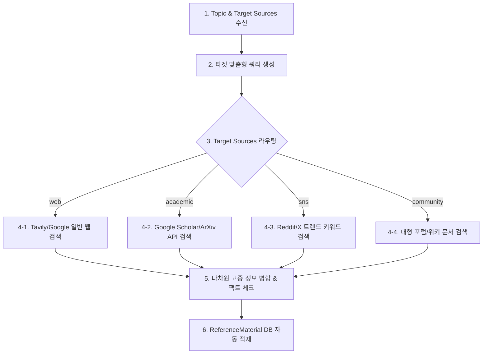

# 리서치 에이전트 및 참고 자료 저장소 기획 및 기술 설계서 (Design Spec)

본 문서는 소설 집필 프로젝트 내에 고증 정보 및 참고 문헌을 검색, 정리, 활용할 수 있는 **리서치 담당관(Researcher Agent) 워크플로우**와 **참고 자료(ReferenceMaterial) 저장소**를 추가하기 위한 제품 기획 및 기술 설계도입니다.

---

## 🎯 1. 요구사항 분석 및 제품 기획

### 1.1. 배경 및 필요성
* 소설(특히 SF, 역사, 전문 장르물) 집필 시 작가는 수많은 사실 관계(Fact)와 고증 자료를 수집합니다.
* 기존 시스템은 '인물'과 '세계관 설정'만 다룰 뿐, 수집한 기사, 과학적 지식 등 보조적인 **참고 자료를 유기적으로 적재해 두고 AI 에이전트들이 이를 활용하게 돕는 메커니즘**이 부재합니다.

### 1.2. 기능 기획 요약
1. **참고 자료 저장소 (Reference Store)**: 프로젝트별로 텍스트 문서, 웹 클리핑, 리서치 보고서를 카테고리별로 저장하고 검색할 수 있는 보관소 제공.
2. **리서치 담당관 (Researcher Agent)**: 사용자가 특정 키워드나 연구 주제를 제시하면, 웹 검색(Web Search API)과 지식 종합 분석을 통해 정교한 팩트 체크 보고서를 자동 작성하고 보관소에 저장해 주는 자율 에이전트 워크플로우 구축.
3. **소설 집필(RAG) 연동**: 집필 에이전트가 에피소드를 작성할 때, 본문의 소재와 부합하는 참고 자료를 DB에서 지능적으로 찾아 프롬프트에 동적으로 공급하여 거짓 정보(Hallucination) 방지.

---

## 🏗️ 2. 기술적 설계 (Technical Architecture)

### 2.1. 데이터베이스 ERD 설계 (SQLModel)
기존 프로젝트 하위에 종속되는 `ReferenceMaterial` 모델을 정의합니다.

```python
from typing import Optional
from sqlmodel import SQLModel, Field, Relationship
from datetime import datetime

class ReferenceMaterial(SQLModel, table=True):
    __tablename__ = "reference_material"

    id: Optional[int] = Field(default=None, primary_key=True)
    project_id: int = Field(foreign_key="project.id", index=True)
    
    title: str = Field(max_length=200, description="자료 제목 및 키워드")
    content: str = Field(description="상세 참고 내용 또는 리서치 보고서 본문")
    category: str = Field(default="etc", description="자료 분류 (history, science, medical, law, etc)")
    source_type: str = Field(default="web", description="자료 출처 소스 타입 (web, academic, sns, community)")
    source_url: Optional[str] = Field(default=None, max_length=500, description="출처 URL 링크")
    
    created_at: datetime = Field(default_factory=datetime.utcnow)
    updated_at: datetime = Field(default_factory=datetime.utcnow)

    # Relationships
    project: "Project" = Relationship(back_populates="reference_materials")
```

기존 `Project` 모델([models.py](file:///C:/Users/parkp/Workspace/personal/my-agent/app/models.py))에 다음 관계 필드를 추가 연동합니다:
```python
# Project 클래스 내부에 추가
reference_materials: List["ReferenceMaterial"] = Relationship(
    back_populates="project", 
    sa_relationship_kwargs={"cascade": "all, delete-orphan"}
)
```

### 2.2. 백엔드 API 명세서 (API Spec)

#### 1) 참고 자료 목록 조회 (페이징 & 카테고리 필터링)
* **HTTP Method**: `GET`
* **Path**: `/api/v1/projects/{project_id}/references`
* **Query Params**: `category` (optional), `search` (optional), `page` (default=1), `size` (default=20)
* **Response**: `200 OK`
```json
{
  "items": [
    {
      "id": 5,
      "project_id": 2,
      "title": "중세 기사의 갑옷 종류 및 무게",
      "content": "중세 14세기 플레이트 아머는 평균 20-25kg 수준이며...",
      "category": "history",
      "source_url": "https://wikipedia.org/wiki/Plate_armour",
      "created_at": "2026-07-15T14:30:00"
    }
  ],
  "total": 1,
  "page": 1,
  "size": 20
}
```

#### 2) 참고 자료 수동 등록
* **HTTP Method**: `POST`
* **Path**: `/api/v1/projects/{project_id}/references`
* **Request Body**:
```json
{
  "title": "블랙홀 이벤트 호라이즌의 조석력 계산",
  "content": "슈바르츠실트 반지름 부근에서의 중력 경사도는...",
  "category": "science",
  "source_url": null
}
```

#### 3) 참고 자료 삭제
* **HTTP Method**: `DELETE`
* **Path**: `/api/v1/projects/{project_id}/references/{ref_id}`

#### 4) 리서치 에이전트(Researcher) 가동 및 자동 보고서 저장
* **HTTP Method**: `POST`
* **Path**: `/api/v1/projects/{project_id}/references/research`
* **Request Body**:
```json
{
  "topic": "조선 후기 포도청의 범죄 조사 방식",
  "category": "history",
  "target_sources": ["web", "academic", "sns", "community"] // 복수 타겟팅 가능
}
```
* **동작**: 백엔드 Celery/Async 태스크 또는 백그라운드 태스크로 `Researcher Agent` 워크플로우를 기동합니다. 에이전트는 설정된 대상 데이터 풀(SNS, 학술자료 등)을 순회 조사하고 결과를 카테고리화된 통합 보고서로 구성한 뒤 `ReferenceMaterial`에 자동 등록합니다.

---

### 🧠 3. 리서치 에이전트(Researcher Agent) 내부 워크플로우 (LangGraph)
리서치 에이전트는 사용자가 지정한 타겟 소스 풀을 분기하여 깊이 있는 리서치 루프를 수행합니다.



1. **Query Generator Node**: 각 소스의 특성에 맞춰 쿼리를 다르게 분기 가공합니다 (예: 학술용은 정밀 키워드 위주, SNS는 구어체/해시태그 위주).
2. **Search Router Node**: 선택된 `target_sources`에 따라 병렬 또는 순차적으로 다른 검색 모듈을 비동기식으로 호출합니다.
3. **Synthesis & Fact Check Node**: 학계의 사실 검증 내용(Academic)과 일반인 트렌드(SNS) 등을 대조하여, 교차 검증된 마크다운 형식의 보고서를 구성합니다.
4. **Saver Node**: 생성된 최종 텍스트와 개별 출처들의 링크를 묶어 `ReferenceMaterial`에 저장합니다.
