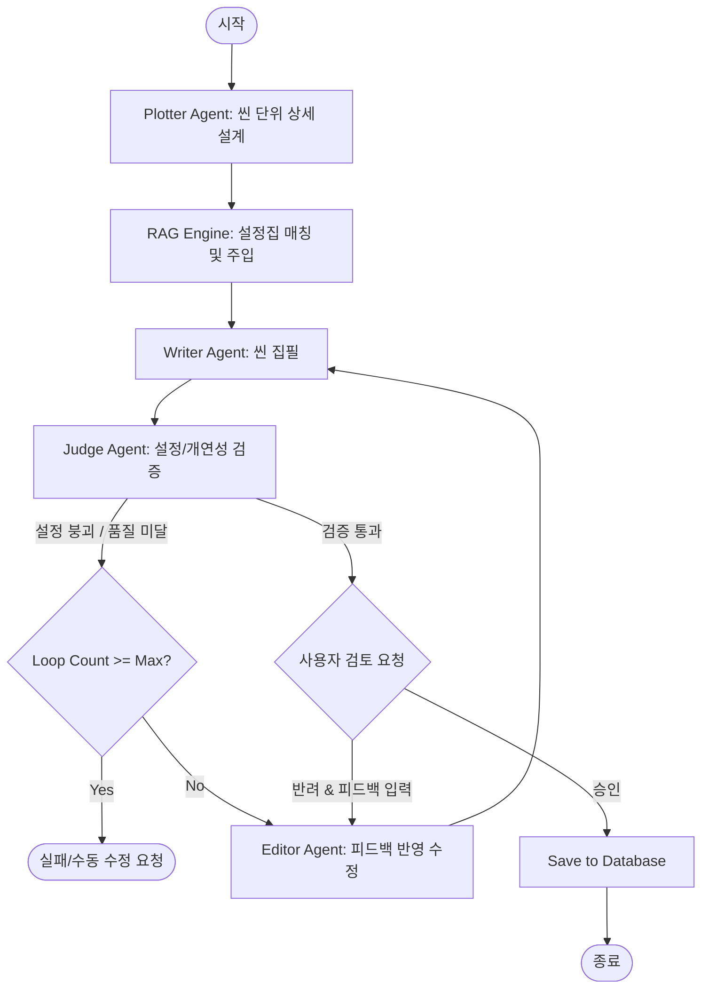

# AI 소설 집필 에이전틱 머신: 보완 설계 사양서 (Supplementary Design Specs)

본 문서는 초기 기획서 및 기술 스택 문서에서 식별된 기술적/기능적 공백을 보완하고, 실제 개발 단계에서 즉시 준수해야 할 상세 스펙을 정의한다.

---

## 1. 에이전트 아키텍처 및 LangGraph 워크플로우 설계

### 1.1 에이전트 상태 (AgentState) 정의
LangGraph 내에서 상태 전이와 데이터 흐름을 추적하기 위해 다음 구조의 `AgentState`를 선언한다.

```python
from typing import TypedDict, List, Optional

class AgentState(TypedDict):
    project_id: int
    episode_id: int
    current_scene_index: int
    scenes: List[dict]           # [{ "index": 0, "title": "...", "plot": "...", "tension": 7, "pace": 5 }]
    lore_context: str            # Lorebook에서 추출된 설정 텍스트
    draft: str                   # 현재 작성 중인 씬 또는 회차 텍스트
    critique: str                # Judge 에이전트의 피드백 및 모순 지적 사항
    user_feedback: Optional[str] # 사용자가 입력한 피드백
    loop_count: int              # 무한 루프 방지용 카운터
    status: str                  # "plotting", "writing", "judging", "waiting_user", "done", "failed"
```

### 1.2 에이전트 순환 그래프 (Cyclic Graph) 구조
에이전트들은 다음과 같이 협업하여 소설을 완성한다.



- **Max Loop Limit**: 에이전트 자체 교정 루프(`LoopCheck`)는 **최대 3회**로 제한하여 무한 루프에 의한 API 요금 폭탄을 방지한다.

---

## 2. 데이터베이스 비동기 처리 및 버전 관리 설계

### 2.1 SQLite 비동기 동시성 (Async Concurrency)
FastAPI의 비동기 핸들러와 충돌이 없도록 `aiosqlite` 드라이버를 사용하며, SQLite WAL(Write-Ahead Logging) 모드를 엔진 생성 시 강제 적용한다.

```python
from sqlalchemy.ext.asyncio import create_async_engine
from sqlalchemy.orm import sessionmaker
from sqlmodel.ext.asyncio.session import AsyncSession
from sqlalchemy import event

DATABASE_URL = "sqlite+aiosqlite:///./novel_machine.db"

async_engine = create_async_engine(
    DATABASE_URL,
    echo=False,
    connect_args={"check_same_thread": False}
)

# SQLite WAL 모드 강제 적용 이벤트 리스너
@event.listens_for(async_engine.sync_engine, "connect")
def set_sqlite_pragma(dbapi_connection, connection_record):
    cursor = dbapi_connection.cursor()
    cursor.execute("PRAGMA journal_mode=WAL;")
    cursor.execute("PRAGMA foreign_keys=ON;")
    cursor.close()

# FastAPI 의존성 주입용 세션 함수
async def get_async_session() -> AsyncSession:
    async_session = sessionmaker(
        async_engine, class_=AsyncSession, expire_on_commit=False
    )
    async with async_session() as session:
        yield session
```

### 2.2 Git-like 소설 텍스트 버전 관리
사용자가 에이전트의 제안 버전을 비교 및 브랜칭(가지치기)할 수 있도록 `Content` 테이블을 트리 구조로 설계한다.

```python
from sqlmodel import SQLModel, Field
from datetime import datetime
from typing import Optional

class Content(SQLModel, table=True):
    id: Optional[int] = Field(default=None, primary_key=True)
    episode_id: int = Field(foreign_key="episode.id")
    parent_id: Optional[int] = Field(default=None, foreign_key="content.id", nullable=True) # 부모 버전을 가리킴 (Root는 Null)
    
    content_text: str
    author_type: str = Field(default="ai") # "ai" | "user" | "hybrid"
    version_tag: str = Field(default="v1.0") # 사용자가 지정하거나 시스템이 생성한 태그 (예: v1.1-feedback-applied)
    
    created_at: datetime = Field(default_factory=datetime.utcnow)
```
- **기능**: 사용자는 특정 `Content`를 부모(`parent_id`)로 삼아 새로운 쓰기 요청을 할 수 있어, 스토리의 멀티 엔딩 및 대체 전개를 효율적으로 추적/유지할 수 있다.

---

## 3. 설정 일관성 검증 (Consistency Guard) 및 RAG 엔진

### 3.1 키워드 기반 경량 RAG 매커니즘
갤럭시 Z 폴드 4 환경의 경량화를 위해 초기 단계에는 Heavy한 Vector DB보다 효율적인 **키워드 기반 DB 매칭**을 우선 적용한다.

1. **키워드 추출**: `Plotter`가 구성한 씬 시놉시스(Plot)에서 명사(인물명, 지명, 주요 오브젝트)를 단순 정규식 또는 LLM을 통해 추출한다.
2. **설정집(Lorebook) 매칭**: 데이터베이스의 `Lorebook` 테이블 내 `keyword` 컬럼과 매칭되는 레코드를 쿼리한다.
3. **컨텍스트 주입**:
   ```
   [시스템 프롬프트 추가 컨텍스트]
   참고해야 할 세계관 및 캐릭터 설정 정보:
   - 아르카나 마법학교: 대륙 남부에 위치한 마법 교육 기관으로, 붉은 벽돌벽이 특징임.
   - 루엘: 마법학교 2학년생. 번개 마법에 재능이 있으나 몸이 약함.
   ```

### 3.2 일관성 검증기 (Consistency Guard)의 검증 프로토콜
`Judge` 에이전트는 작성된 초안(`draft`)과 추출된 설정 정보(`lore_context`)를 대조하여 검증을 진행한다.

* **검증 프롬프트 제약**:
  ```
  당신은 소설의 개연성과 설정 일관성을 검수하는 전문 편집자(Judge)입니다.
  아래의 [세계관 및 캐릭터 설정]과 [작성된 초안]을 비교하십시오.
  
  [세계관 및 캐릭터 설정]
  {lore_context}
  
  [작성된 초안]
  {draft}
  
  검수 기준:
  1. 초안에 설정과 충돌하거나 모순되는 설명이 있는가? (예: 루엘이 갑자기 불 마법을 강력하게 다루거나 강인한 체력을 뽐냄)
  2. 캐릭터의 성격이나 말조새가 설정과 어긋나는가?
  
  형식 제한:
  - 통과 여부: [PASS / FAIL]
  - 이유 (FAIL일 경우 구체적인 모순점 나열):
  ```

---

## 4. 실시간 에이전트 모니터링 및 UX 통신 사양

### 4.1 WebSocket 프로토콜 명세 (실시간 스트리밍 & 상태)
FastAPI 백엔드와 프론트엔드 간의 상태 중계 및 텍스트 스트리밍은 WebSocket을 통해 비동기로 이루어진다.

* **Endpoint**: `/ws/projects/{project_id}/episodes/{episode_id}/write`
* **클라이언트 $\rightarrow$ 서버 (시작 요청)**:
  ```json
  {
    "action": "start_writing",
    "tension_level": 7,
    "pace_level": 5,
    "user_instruction": "루엘이 라이벌과 첫 결투를 벌이는 긴장감 넘치는 씬으로 만들어줘."
  }
  ```
* **서버 $\rightarrow$ 클라이언트 (상태 전이 메시지)**:
  ```json
  {
    "event": "status_changed",
    "status": "plotting",
    "message": "에이전트가 씬 시놉시스를 계획하는 중입니다..."
  }
  ```
* **서버 $\rightarrow$ 클라이언트 (실시간 집필 스트리밍)**:
  ```json
  {
    "event": "text_stream",
    "status": "writing",
    "chunk": "루엘의 손끝에서 자지러지는 번개 스파크가 튀었다. "
  }
  ```
* **서버 $\rightarrow$ 클라이언트 (사용자 검토 및 피드백 요청)**:
  ```json
  {
    "event": "requires_user_review",
    "status": "waiting_user",
    "draft_content_id": 42,
    "draft_text": "루엘의 손끝에서 자지러지는 번개 스파크가 튀었다. (중략) 그는 승리를 쟁취했다."
  }
  ```

### 4.2 호흡 컨트롤러 (Tension & Pace) 매핑 규칙
사용자가 설정한 호흡 수치(1~10)는 LLM 프롬프트에 다음과 같은 지시문 형태로 변환되어 삽입된다.

* **Tension (긴장도 1~10)**:
  - **1~3 (낮음)**: "여유롭고 서정적인 묘사 위주로 작성하며, 인물의 심리적 안정감을 강조하세요."
  - **4~7 (보통)**: "일상적인 긴장감을 유지하며 대화와 행동을 균형 있게 배치하세요."
  - **8~10 (높음)**: "문장을 단문 위주로 호흡을 짧게 가져가고, 극적인 갈등이나 위험 요소를 즉각 부각하여 극단적인 긴장감을 유도하세요."
* **Pace (전개 속도 1~10)**:
  - **1~3 (느림)**: "배경 묘사와 세부 묘사를 장황하고 풍부하게 작성하세요."
  - **8~10 (빠름)**: "부가적인 환경 묘사는 최소화하고, 인물의 핵심 행동과 사건 중심의 빠른 이야기 전개에 집중하세요."
