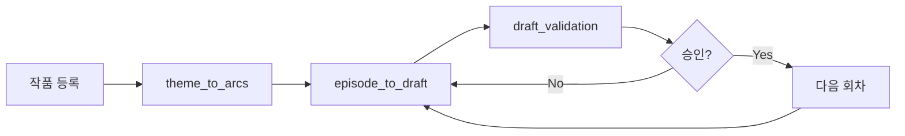

# my-agent 사용 가이드

AI를 활용한 장편 웹소설 제작 운영 시스템의 설치, 실행, 워크플로우 사용 방법을 정리한 문서다.

---

## 1. 시스템 개요

이 프로젝트는 **여러 AI 에이전트가 단계별로 협업**하여 소설 기획·집필·검수를 수행하는 시스템이다.

| 레이어 | 경로 | 역할 |
|--------|------|------|
| Core | `src/my_agent/` | SQLite DB, 도메인 모델, 리포지토리, 메모리 저장소 |
| Agents | `packages/agents/` | 테마 탐색, 기획, 집필, 검수 등 역할별 AI 모듈 |
| Orchestrator | `packages/orchestrator/workflows.py` | LangGraph 기반 워크플로우 (에이전트 연결) |
| Admin UI | `apps/admin/main.py` | Streamlit 운영 콘솔 |

### 전체 제작 흐름



1. **작품(novel) 등록** — DB에 프로젝트 생성
2. **theme_to_arcs** — 테마 탐색 → 마스터 플랜 → 아크 설계
3. **episode_to_draft** — 회차 사이클 → 회차 상세 → 본문 집필
4. **draft_validation** — 연속성(continuity) 검수
5. **승인/반려** — Admin Console 또는 리포지토리로 결과 처리

---

## 2. import 경로 구조

이 프로젝트는 **두 레이어**로 나뉘며, 서로 다른 디렉터리에 있다.

| import | 실제 경로 | 설명 |
|--------|-----------|------|
| `my_agent.*` | `src/my_agent/` | Core (DB, 리포지토리, 메모리) |
| `packages.*` | `packages/` | Agents, Orchestrator, Embeddings |

`pathsetup.py`가 두 경로를 `sys.path`에 등록한다. 각 진입점에서 호출된다.

- `main.py`, `apps/admin/main.py`, `scripts/bootstrap.py` — `ensure_project_paths()` 호출
- `pytest` — `pyproject.toml`의 `pythonpath = ["src", "."]`
- `run.ps1` / `run.sh` — 프로젝트 루트에서 실행 (별도 `PYTHONPATH` 불필요)

> `from src.my_agent...` 형식은 사용하지 않는다. `src/`는 Python 패키지가 아니다.

---

## 3. 사전 요구 사항

- **Python 3.11 이상** (`pyproject.toml`: `requires-python = ">=3.11"`)
- 프로젝트 루트에서 작업 (`pathsetup.py`가 `src/`·`packages/` 경로를 자동 설정)
- (선택) Ollama — 임베딩을 로컬 LLM으로 쓸 때만 필요

---

## 4. 환경 설정

### 4.1 가상환경 생성 및 의존성 설치

**Windows (PowerShell)**

```powershell
cd C:\path\to\my-agent
python -m venv .venv
.\.venv\Scripts\Activate.ps1
python -m pip install --upgrade pip
pip install -r requirements-dev.txt
```

**macOS / Linux**

```bash
cd /path/to/my-agent
python3 -m venv .venv
source .venv/bin/activate
python -m pip install --upgrade pip
pip install -r requirements-dev.txt
```

### 4.1a 원터치 실행 (권장)

설정·DB 초기화·데모 작품 생성·Admin Console까지 한 번에 실행한다.

**Windows**

```powershell
.\scripts\run.bat            # 더블클릭 가능
.\scripts\run.ps1            # 동일
.\scripts\run.ps1 start      # 명시적 start
```

**macOS / Linux**

```bash
chmod +x scripts/run.sh
./scripts/run.sh
```

| 명령 | 설명 |
|------|------|
| `start` (기본) | venv 확인 → DB 초기화 → 데모 작품 → Admin Console |
| `setup` | `.venv` 생성 및 의존성 설치 |
| `init-db` | SQLite 스키마 생성 |
| `bootstrap` | DB가 비어 있으면 데모 작품(`demo-novel-001`) 등록 |
| `test` | `pytest` 실행 |
| `admin` | Streamlit Admin Console만 실행 |
| `help` | 명령 목록 표시 |

### 4.1b 수동 설정

```powershell
.\scripts\setup.ps1          # Windows
```

```bash
./scripts/setup.sh           # macOS / Linux
```

### 4.2 데이터베이스 초기화

가상환경을 활성화한 뒤, 프로젝트 루트에서 실행한다.

```bash
python main.py --init-db
```

- 기본 DB 경로: `data/my_agent.db`
- 다른 경로를 쓰려면: `python main.py --db path/to/custom.db --init-db`

### 4.3 동작 확인

```bash
pytest
```

22개 테스트가 통과하면 환경 설정이 완료된 것이다.

---

## 5. 실행 방법

### 5.1 CLI — DB 초기화

```bash
python main.py --init-db
```

스키마만 생성한다. 워크플로우 실행은 Python API 또는 Admin Console을 사용한다.

### 5.2 Admin Console (Streamlit UI)

가장 쉬운 운영 진입점이다.

```bash
streamlit run apps/admin/main.py
```

`apps/admin/main.py`가 시작 시 `pathsetup.ensure_project_paths()`를 호출하므로 `PYTHONPATH` 설정은 필요 없다.

브라우저에서 `http://localhost:8501` 이 열린다.

#### 메뉴 구성

| 메뉴 | 기능 |
|------|------|
| **Project Overview** | 등록된 작품 목록, 캐릭터·회차 조회 |
| **Workflow Execution** | 3가지 워크플로우 실행 |
| **Validation Review** | 검수 결과 조회 및 승인/반려 |
| **System Logs** | `generation_runs` 로그 조회 |

> Admin Console은 실제 `MemoryStore`와 `NovelRepository`를 사용한다. `theme_to_arcs` 실행 후 `episode_to_draft`를 실행하면 DB에 저장된 아크 플랜을 자동 로드한다.

### 5.3 Python API — 워크플로우 직접 실행

테스트 코드(`tests/test_workflows.py` 등)와 동일한 패턴으로 사용한다.

#### Step 0: 작품 등록

Admin UI에는 작품 생성 화면이 없으므로, **최초 1회는 Python으로 등록**한다.

```python
from my_agent.repository import NovelRepository
from my_agent.schemas import NovelCreate

repo = NovelRepository("data/my_agent.db")
repo.create_novel(NovelCreate(
    novel_id="my-novel-001",
    title="회귀 용사의 밤",
    genre="fantasy",
    target_format="webnovel",
))
```

#### Step 1: theme_to_arcs — 테마 → 마스터 플랜 → 아크

```python
from my_agent.memory import MemoryStore
from my_agent.repository import NovelRepository
from packages.orchestrator.workflows import build_theme_to_arcs_workflow
from packages.schemas.agent_schemas import ThemeToArcsRequest

repo = NovelRepository("data/my_agent.db")
memory = MemoryStore("data/my_agent.db")  # 동일 DB 사용 가능

workflow = build_theme_to_arcs_workflow(repo, memory)
result = workflow.invoke({
    "request": ThemeToArcsRequest(
        novel_id="my-novel-001",
        user_preferences="회귀, 성장, 제국 판타지",
        genre_constraints=["fantasy", "growth"],
        market_positioning="장기 연재용 웹소설",
        target_main_arc_count=3,
        target_sub_arc_count=6,
    ),
    "novel_id": "my-novel-001",
    "current_stage": "start",
    "status": "running",
})

print(result["current_stage"])   # ArcsPlanned
print(result["arc_output"])      # main_arcs, sub_arcs
```

생성되는 데이터: concept, theme, world_rules, arc, draft, memory_document

#### Step 2: episode_to_draft — 회차 계획 → 상세 → 본문

```python
from packages.orchestrator.workflows import build_episode_to_draft_workflow
from packages.schemas.agent_schemas import ArcPlanSpec, EpisodeToDraftRequest

workflow = build_episode_to_draft_workflow(repo, memory)
result = workflow.invoke({
    "request": EpisodeToDraftRequest(
        novel_id="my-novel-001",
        approved_arcs=[
            ArcPlanSpec(
                arc_number=1,
                title="각성",
                objective="주인공 각성",
                conflict="첫 충돌",
                payoff="첫 보상",
                episode_range="1-10화",
            ),
        ],
        target_episode_count=20,
        selected_episode_number=1,  # 집필할 회차 번호
    ),
    "current_stage": "start",
    "status": "running",
})

print(result["draft_output"]["draft_text"])
```

#### Step 3: draft_validation — 연속성 검수

```python
from packages.orchestrator.workflows import build_draft_validation_workflow
from packages.schemas.agent_schemas import (
    CharacterStateSpec,
    DraftValidationRequest,
    SceneBeatSpec,
    TimelineEventSpec,
)

workflow = build_draft_validation_workflow(repo, memory)
result = workflow.invoke({
    "request": DraftValidationRequest(
        novel_id="my-novel-001",
        draft_id="draft-1",
        draft_text=result["draft_output"]["draft_text"],  # Step 2 결과
        scene_beats=[...],
        character_states=[...],
        timeline_events=[...],
    ),
    "current_stage": "DraftWritten",
    "status": "running",
})

print(result["status"])  # approved | rejected
```

---

## 6. 에이전트 목록

| 에이전트 | 파일 | 워크플로우 포함 | 역할 |
|----------|------|----------------|------|
| ThemeScoutAgent | `theme_scout_agent.py` | theme_to_arcs | 소재·테마·상업성 평가 |
| MasterPlannerAgent | `master_planner_agent.py` | theme_to_arcs | 로그라인, 세계관, 전체 뼈대 |
| ArcPlannerAgent | `arc_planner_agent.py` | theme_to_arcs | 메인/서브 아크 설계 |
| EpisodeCycleAgent | `episode_cycle_agent.py` | episode_to_draft | 회차 카드·리듬 설계 |
| EpisodeDetailAgent | `episode_detail_agent.py` | episode_to_draft | 장면 비트·감정 곡선 |
| SceneWriterAgent | `scene_writer_agent.py` | episode_to_draft | 본문 집필 |
| ContinuityJudgeAgent | `continuity_judge_agent.py` | draft_validation | 설정·타임라인 연속성 검수 |
| StyleJudgeAgent | `style_judge_agent.py` | *(단독)* | 문체·가독성 검수 |
| ReaderHookJudgeAgent | `reader_hook_judge_agent.py` | *(단독)* | 화말 훅·몰입도 검수 |

`StyleJudgeAgent`, `ReaderHookJudgeAgent`는 단위 테스트로 검증되며, 오케스트레이터 워크플로우에는 아직 연결되지 않았다. 직접 호출 예:

```python
from packages.agents.style_judge_agent import StyleJudgeAgent
from packages.agents.reader_hook_judge_agent import ReaderHookJudgeAgent

style_agent = StyleJudgeAgent(repository=repo, memory_store=memory)
style_result = style_agent.judge(
    novel_id="my-novel-001",
    draft_id="draft-1",
    draft_text="...",
    scene_beats=[],
    style_rules=["fast-paced", "1인칭"],
)
```

---

## 7. 설정 파일

### 7.1 승인 정책 — `config/approval_policy.json`

워크플로우 각 단계의 자동 승인·수동 검토 기준을 정의한다.

| 키 | 설명 | 기본값 |
|----|------|--------|
| `auto_approve_threshold` | 이 점수 이상이면 자동 승인 | 0.85 |
| `manual_review_threshold` | 이 점수 이상이면 수동 검토 | 0.6 |
| `critical_requires_manual_review` | 치명적 이슈 시 무조건 수동 검토 | true |
| `stage_overrides` | 단계별 임계값 오버라이드 | concept, master_plan 등 |

점수가 임계값 미만이면 워크플로우가 `MANUAL_REVIEW` 상태로 중단된다.

### 7.2 임베딩 — `config/embedding_config.json`

메모리 검색(RAG)에 쓰이는 임베딩 백엔드를 설정한다.

```json
{
  "mode": "local",
  "local_model_name": "sentence-transformers/all-MiniLM-L6-v2",
  "ollama_model_name": "nomic-embed-text",
  "ollama_base_url": "http://localhost:11434",
  "dimension": 384
}
```

| mode | 동작 |
|------|------|
| `local` | sentence-transformers 로컬 모델 (없으면 hash 폴백) |
| `ollama` | Ollama 임베딩 API (실패 시 local 폴백) |

Ollama 사용 시:

1. Ollama 설치 및 `ollama pull nomic-embed-text`
2. `embedding_config.json`에서 `"mode": "ollama"` 로 변경
3. `EmbedderFactory(mode="ollama")` 로 워크플로우 생성

---

## 8. 데이터 저장 위치

| 경로 | 내용 |
|------|------|
| `data/my_agent.db` | SQLite DB (작품, 회차, 초안, 검수, 메모리 등) |
| `config/` | 승인 정책, 임베딩 설정 |
| `~/.cache/huggingface/` | sentence-transformers 모델 캐시 (최초 실행 시 다운로드) |

주요 테이블: `novels`, `arcs`, `episodes`, `drafts`, `validations`, `memory_documents`, `generation_runs`

---

## 9. 일반적인 운영 시나리오

### 시나리오 A: Admin Console로 빠르게 둘러보기

1. `.\scripts\run.bat` (Windows) 또는 `./scripts/run.sh` (Linux) 실행
2. 브라우저에서 Admin Console 확인 (`http://localhost:8501`)
3. **Project Overview**에서 데모 작품(`demo-novel-001`) 확인
5. **Workflow Execution**에서 `theme_to_arcs` 실행
6. **Validation Review** / **System Logs**에서 결과 확인

### 시나리오 B: Python 스크립트로 전체 파이프라인

1. 환경 설정 및 DB 초기화
2. `create_novel` → `theme_to_arcs` → `episode_to_draft` → `draft_validation` 순서 실행
3. `result` dict에서 각 단계 `*_decision` 필드로 승인 여부 확인
4. `status == "manual_review"` 이면 `config/approval_policy.json` 조정 또는 수동 검토 후 재실행

### 시나리오 C: 테스트로 동작 학습

```bash
pytest tests/test_workflows.py -v
pytest tests/test_episode_workflow.py -v
pytest tests/test_validation_workflow.py -v
```

각 테스트가 최소 실행 예제 역할을 한다.

---

## 10. 문제 해결

### `ModuleNotFoundError: No module named 'sqlalchemy'`

가상환경이 활성화되지 않았거나 의존성이 설치되지 않은 상태다.

```powershell
.\.venv\Scripts\Activate.ps1
pip install -r requirements-dev.txt
```

### `ModuleNotFoundError: No module named 'my_agent'` 또는 `'packages'`

프로젝트 루트가 아닌 곳에서 실행했거나 `pathsetup`이 적용되지 않은 진입점이다. **프로젝트 루트에서** 실행하거나 `.\scripts\run.bat`을 사용한다. 커스텀 스크립트에서는 `pathsetup.ensure_project_paths()`를 호출한다.

### `Activate.ps1` 실행 정책 오류 (Windows)

```powershell
Set-ExecutionPolicy -Scope CurrentUser RemoteSigned
```

또는 venv Python을 직접 사용:

```powershell
.\.venv\Scripts\python.exe main.py --init-db
```

### HuggingFace symlink 경고 (Windows)

sentence-transformers 최초 실행 시 Windows symlink 미지원 경고가 나올 수 있다. 동작에는 영향 없다. 무시하려면:

```powershell
$env:HF_HUB_DISABLE_SYMLINKS_WARNING = "1"
```

### 워크플로우가 `manual_review`에서 멈춤

`config/approval_policy.json`의 임계값을 낮추거나, `result["*_decision"]["critical_issues"]`를 확인해 입력 데이터를 보완한 뒤 재실행한다.

### Admin Console에 작품이 없음

UI에는 작품 생성 기능이 없다. [Step 0: 작품 등록](#step-0-작품-등록) 절차로 Python에서 먼저 등록한다.

---

## 11. 참고 문서

- [README.md](../README.md) — 설치 요약
- [Agents.md](../Agents.md) — 에이전트 작업 규칙
- [novel_blueprint/05_agents.md](../novel_blueprint/05_agents.md) — 에이전트 상세 명세
- [docs/handover/05_phase5_complete.md](handover/05_phase5_complete.md) — Phase 5 구현 완료 요약